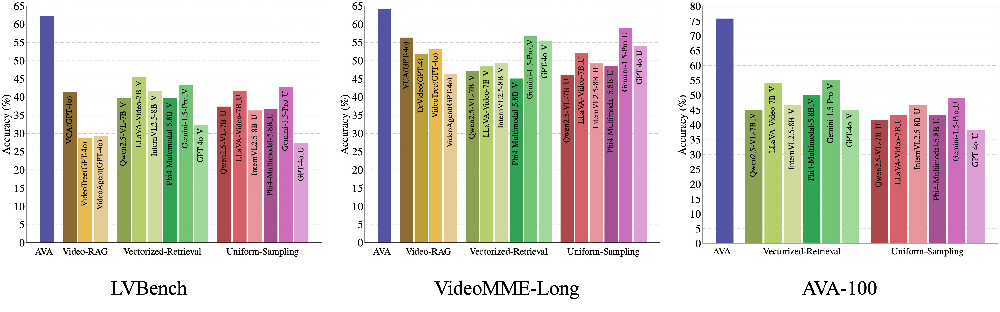
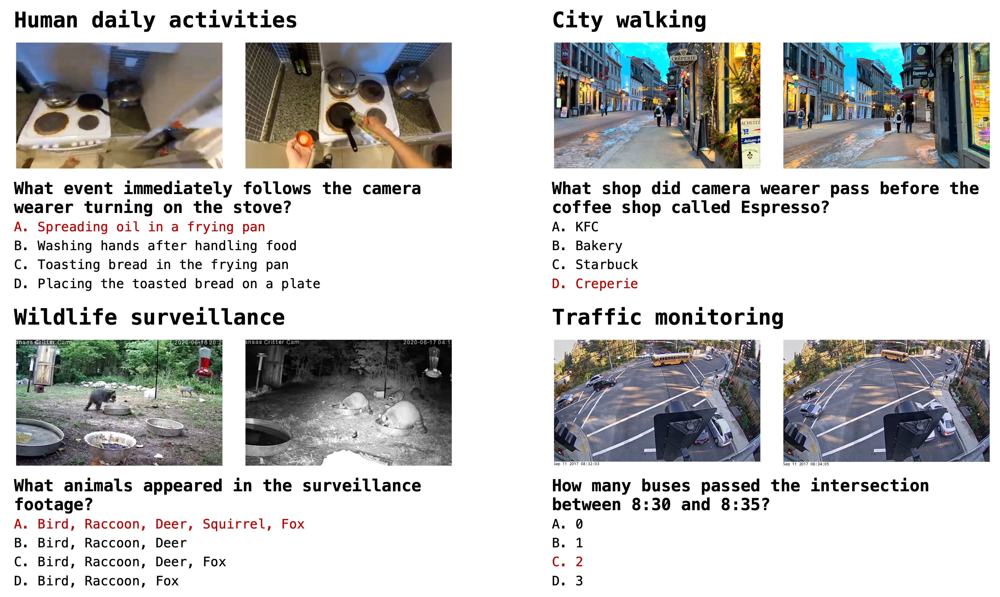

# Project-Ava
An implementation of Paper "AVA: Towards Agentic Video Analytics with Vision Language Models"
> 📰 **Paper:**  [Arxiv](https://arxiv.org/abs/2505.00254)

## 📰 News
- **[2025/08/01]** Gemini-1.5-Pro has been officially deprecated. We recommend everyone to try the more powerful Gemini-2.5-Pro. You can apply for the API [here](https://aistudio.google.com/apikey).
- **[2025/06/27]** We have released the AVA-100 dataset on [Hugging Face](https://huggingface.co/datasets/iesc/Ava-100).

## 🔧 Key Features
- **Task Definition**: Define five levels of intelligence (L1–L5) for current and future video analysis systems. AVA is the first L4 video analytics system powered by VLMs, enabling open-ended comprehension, reasoning, and analytics—marking a significant advancement.
- **Near-real-time index construction**: AVA employs Event-Knowledge Graphs (EKGs) to construct video index, supporting near real-time indexing even on common edge devices (2 $\times$ RTX 4090).
- **Agentic retrieval and generation**: AVA uses LLM as an agent to proactively explore and retrieve additional event information related to prior results, enabling multi-path reasoning and response generation based on aggregated data.
- **Proposed benchmark**: Proposes AVA-100, an ultra-long video benchmark designed to evaluate video analysis capabilities, comprising 8 videos (each over 10 hours) and 120 manually annotated questions across four scenarios: human daily activities, city walking, wildlife surveillance, and traffic monitoring.
- AVA achieves $62.3\%$ on LVBench, $62.3\%$ on VideoMME-Long, and $75.8\%$ on the proposed AVA-100 benchmark, outperforming mainstream VLMs and Video-RAG methods under the same settings.



---
## 📹 AVA-100
AVA-100 is proposed by us, which is an ultra-long video
benchmark specially designed to evaluate video analysis
capabilities Avas-100 consists of 8 videos, each exceeding
10 hours in length, and includes a total of 120 manually
annotated questions. The benchmark covers four typical
video analytics scenarios: human daily activities, city walking, wildlife surveillance, and traffic monitoring, each scenario contains two videos.  All questions are carefully
designed by human annotators, who also provide reference
answers as the ground truth. In addition, GPT-4o is utilized
to generate plausible distractor options.
- **Human daily activities**: Selected and stitched from egocentric footage in the [Ego4D](https://ego4d-data.org/).
- **City walking**: Selected from publicly available YouTube videos, capturing urban exploration.
- **Wildlife surveillance**: Selected from publicly available YouTube videos, capturing animal monitoring.
- **Traffic monitoring**: Selected and stitched from monitoring videos in the [Bellevue Traffic Video Dataset](https://github.com/City-of-Bellevue/TrafficVideoDataset).



---
## 📦 Installation
```bash
git clone https://github.com/I-ESC/Project-AVA.git
cd Project-AVA
conda create -n ava python=3.9
conda activate ava
pip install -r requirements.txt
```

For API-based stronger models, export keys before running:
```bash
export GEMINI_API_KEY=...
# or
export OPENAI_API_KEY=...
```

---
## Dataset Preparation
In our project, the dataset is organized as follows:
```bash
datas/
└── [dataset_name]/
    ├── videos/     # folder stores raw videos
    ├── *.json.     # raw videos information and question-answers
    └── download.sh # quick download script 
```

We recommend using the provided script to download the dataset:
```bash
# supported dataset: LVBench, VideoMME, AVA100
cd datas/[dataset-name]
./download.sh
```

## Video Preprocessing
Since the videos processed in this project are relatively long, we choose to preprocess them into frames and store them on disk, instead of dynamically loading them into memory for each operation. This method improves processing speed and is more friendly to hardware resources. Additionally, to speed up the processing, we employ parallel processing techniques:
```bash
python preprocess_videos.py --dataset [lvbench/videomme/ava100] --num_threads 10 # Set num_threads based on your hardware capabilities.
```
All intermediate results in our project are organized under the **AVA_cache** folder. After processing the video frames, you should see the following files:
```bash
AVA_cache/
└── LVBench/
    ├── 1                # video id
        ├── frames       # folder stores raw frames
        ├── config.json  # video's raw info, including resolution, duration, and so on.
        ├── ...
    ├── 2
    ├── ...

└── VideoMME/
    ├── 601
    ├── 602
    ├── ...

└── AVA100/
    ├── 1
    ├── 2
    ├── ...

```

---
## Graph Construction
Construct event knowledge graph for the video:
```bash
# View llms.init_model.py for supported models
# View dataset.init_dataset.py for supported dataset
# View datas/[dataset_name]/[dataset_name.json] for video_id, LVBench: 1-103, VideoMME: 601-900, AVA-100: 1-8
python graph_construction.py --model [name_of_model] --dataset [name_of_dataset] --video_id [id_of_video] --gpus [num_of_gpus]
```
Constructing the graph is a time-consuming process. For example, building a graph for a 10-hour video can take 3–5 hours (the actual time depends on the hardware used). Therefore, we recommend directly downloading our pre-built graphs from [here](https://drive.google.com/drive/folders/1g4Zmc8vsly3TofkIcj-n8Z1M0KsX9qox?usp=drive_link) and merging them into the **AVA_cache** folder. After this, the folder structure should be as follows:
```bash
AVA_cache/
└── LVBench/
    ├── 1                
        ├── frames       
        ├── config.json  
        ├── kg
            ├── vdb_events.json
            ├── vdb_entities.json
            ├── vdb_relations.json
            ├── graph_event_knowledge_graph.graphml
            ├── ...

    ├── 2
    ├── ...
```

## Generate Summary_and_Answer Result
You can generate answers to questions about a specific video in the following way:
```bash
# View datas/[dataset_name]/[dataset_name.json] for question_id
python query_SA.py --model [name_of_model] --dataset [name_of_dataset] --video_id [id_of_video] --question_id [id_of_question]--gpus [num_of_gpus]

# example
python query_SA.py --model qwenlm --dataset lvbench --video_id 1 --question_id 0 --gpus 1
```

You can also run the results for the entire dataset using the following way:
```bash
# Setting video_id to -1 indicates that the entire dataset will be processed.
python query_SA.py --model [name_of_model] --dataset [name_of_dataset] --video_id -1 --gpus [num_of_gpus]

# example
python query_SA.py --model qwenlm --dataset lvbench --video_id -1 --gpus 1
```

## Generate Check_raw_frame_and_Answer Result
Here, we would like to clarify that the results in the paper were produced using Gemini-1.5-Pro. However, over time, Gemini-1.5-Pro has been deprecated by Google. Therefore, we recommend using QwenVL2.5-7B. (results using this model are also presented in the paper).

You can generate answers to questions about a specific video in the following way ( **Note**：Before generating the CA Result, the corresponding SA Result must have already been produced ):
```bash
# View datas/[dataset_name]/[dataset_name.json] for question_id
python query_SA.py --model [name_of_model] --dataset [name_of_dataset] --video_id [id_of_video] --question_id [id_of_question]--gpus [num_of_gpus]

# example
python query_CA.py --model qwenvl --dataset lvbench --video_id 1 --question_id 0 --gpus 1
```

You can also run the results for the entire dataset using the following way:
```bash
# Setting video_id to -1 indicates that the entire dataset will be processed.
python query_CA.py --model [name_of_model] --dataset [name_of_dataset] --video_id -1 --gpus [num_of_gpus]

# example
python query_CA.py --model qwenvl --dataset lvbench --video_id -1 --gpus 1
```

## ASD-JITAI Custom Video Pipeline
This repo now includes a role-aware custom video pipeline for caregiver-facing ASD just-in-time intervention prototyping. It keeps the original benchmark QA workflow intact and adds:

- custom video indexing without dataset wrappers
- open-ended structured JSON outputs
- role-aware entity extraction (`child_1`, `caregiver_1`, etc.)
- optional audio extraction and transcription
- windowed JITAI assessments and rule-based intervention suggestions

### Example config files
Sample configs are provided in:
```bash
configs/child_profile.example.json
configs/scene_context.example.json
configs/intervention_library.example.json
```

### Run JITAI analysis on your own video
```bash
python custom_video.py \
  --video_path /path/to/parent_child.mp4 \
  --work_dir AVA_cache/custom/session_001 \
  --mode jitai \
  --extract_model auto \
  --reasoner_model auto \
  --profile_json configs/child_profile.example.json \
  --scene_context_json configs/scene_context.example.json \
  --intervention_json configs/intervention_library.example.json \
  --window_seconds 15 \
  --stride_seconds 5
```

If `OPENAI_API_KEY` is set, you can optionally add audio transcription:
```bash
python custom_video.py \
  --video_path /path/to/parent_child.mp4 \
  --work_dir AVA_cache/custom/session_001 \
  --mode jitai \
  --extract_model auto \
  --reasoner_model auto \
  --profile_json configs/child_profile.example.json \
  --scene_context_json configs/scene_context.example.json \
  --intervention_json configs/intervention_library.example.json \
  --transcription_model gpt-4o-transcribe
```

### Ask an open-ended question about a custom video
```bash
python custom_video.py \
  --video_path /path/to/parent_child.mp4 \
  --work_dir AVA_cache/custom/session_001 \
  --mode query \
  --query "When does the caregiver move close to the child and offer support?" \
  --extract_model auto \
  --reasoner_model auto
```

### Outputs
The custom pipeline writes artifacts under:
```bash
AVA_cache/custom/session_001/
├── frames/
├── kg/
├── audio/
└── jitai/
    ├── config_snapshot.json
    ├── jitai_timeline.json
    ├── jitai_alerts.json
    ├── jitai_summary.json
    ├── query_0.json
    └── windows/
```

`jitai_timeline.json` contains per-window structured state estimates. `jitai_alerts.json` contains windows where the policy engine decided a caregiver-facing intervention suggestion should fire.

## Video Labeler

This repo also includes `video-labeler/`, a browser-based tool for importing public video URLs and saving cue-access-response social interaction labels with timestamps, access judgments, response/no-response events, evidence spans, and optional episode notes.


Run it from the `video-labeler/` folder:

```bash
npm test
npm run start
```

Then open `http://localhost:4173` in Chrome or Edge. The labeler writes `index.csv`, `meta.json`, and `labels.json` to the selected output folder.


## 📄 Citation

If you use this repo, please cite our paper:
```bibtex
@inproceedings{ava,
  title={AVA: Towards Agentic Video Analytics with Vision Language Models},
  author={Yan, Yuxuan and Jiang, Shiqi and Cao, Ting and Yang, Yifan and Yang, Qianqian and Shu, Yuanchao and Yang, Yuqing and Qiu, Lili},
  booktitle={USENIX Symposium on Networked Systems Design and Implementation (NSDI)},
  year={2026}
}
```
