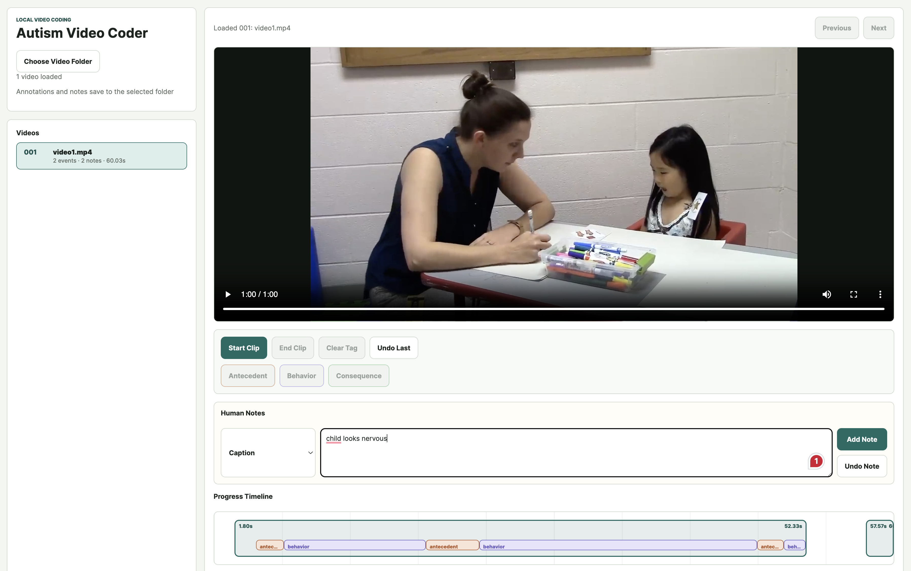

# Autism Video ABC Coder

Autism Video ABC Coder is a local browser tool for coding video clips with the ABC framework: **Antecedents, Behavior, and Consequences**. It helps a human coder load videos from a local folder, mark event clips, tag ABC segments within each clip, and add timestamped captions, notes, or comments while watching.



## What The Tool Does

- Loads a folder of local videos and shows one video at a time.
- Creates an indexed queue such as `001`, `002`, and `003`.
- Lets coders mark event clips with `Start Clip` and `End Clip`.
- Lets coders tag spans inside an open clip as `antecedent`, `behavior`, or `consequence`.
- Closes the active ABC span when another tag is clicked, `Clear Tag` is clicked, or the event clip ends.
- Adds timestamped human `caption`, `note`, and `comment` entries.
- Visualizes coded event windows and ABC segment durations on the progress timeline.
- Writes structured output files back into the selected video folder.

## Quick Start

From the `autism-video-ABC-coder/` folder:

```bash
npm test
npm run start
```

Then open `http://localhost:4174` in Chrome or Edge.

The app uses the File System Access API, so folder mounting and file writing require a Chromium-based browser on localhost.

## How To Code A Video

1. Click `Choose Video Folder` and select a folder containing videos.
2. Select a video from the queue if more than one video is loaded.
3. Play, pause, or scrub to the start of an event.
4. Click `Start Clip`.
5. While the clip is open, click `antecedent`, `behavior`, or `consequence` when that span begins.
6. Click another ABC tag to switch spans, or click `Clear Tag` to stop tagging without opening a new span.
7. Click `End Clip` when the event is over.
8. Use Human Notes to add timestamped `caption`, `note`, or `comment` text at the current playback time.
9. Use `Undo Last` for event/tag coding mistakes, or `Undo Note` for note-taking mistakes.

## Human Notes

Human notes are separate from ABC tags. They are useful for:

- `caption`: what is said, seen, or heard at that timestamp.
- `note`: a coder observation.
- `comment`: an interpretation, question, uncertainty, or review comment.

Each note records its type, timestamp, text, and creation time.

## Saved Output

When a folder is selected, the app writes an index file and one numbered folder per video.


Example layout:

```text
videos/
  index.csv
  video1.mp4
  001/
    meta.json
    labels.json
```

`index.csv` stores the video queue:

```csv
index,file_name,source_type,folder_name,created_at
001,video1.mp4,local-video,001,2026-05-01T06:24:28.143Z
```

`meta.json` stores video-level metadata and summary counts:

```json
{
  "index": "001",
  "folderName": "001",
  "fileName": "video1.mp4",
  "sourceType": "local-video",
  "durationSeconds": 60.033333,
  "eventCount": 2,
  "completedEventCount": 2,
  "noteCount": 2,
  "captionCount": 2,
  "commentCount": 0,
  "openEventId": null
}
```

`labels.json` stores the coded clips, ABC segments, and human notes:

```json
{
  "videoIndex": "001",
  "fileName": "video1.mp4",
  "events": [
    {
      "id": "e1",
      "startTimestampSeconds": 1.796985,
      "endTimestampSeconds": 52.327163,
      "segments": [
        {
          "id": "s1",
          "tag": "antecedent",
          "startTimestampSeconds": 3.612258,
          "endTimestampSeconds": 6.087532
        },
        {
          "id": "s2",
          "tag": "behavior",
          "startTimestampSeconds": 6.087532,
          "endTimestampSeconds": 18.674994
        }
      ]
    }
  ],
  "notes": [
    {
      "id": "n1",
      "kind": "caption",
      "timestampSeconds": 16.336442,
      "text": "child looks confused and anxious"
    }
  ]
}
```

## Supported Video Files

The folder loader recognizes common browser-playable video files:

- `.mp4`
- `.webm`
- `.ogg`
- `.ogv`
- `.mov`
- `.m4v`

## Development

Run the test suite:

```bash
npm test
```

Start the local static server:

```bash
npm run start
```

If port `4174` is already in use, run a server on another port:

```bash
python3 -m http.server 4175
```
