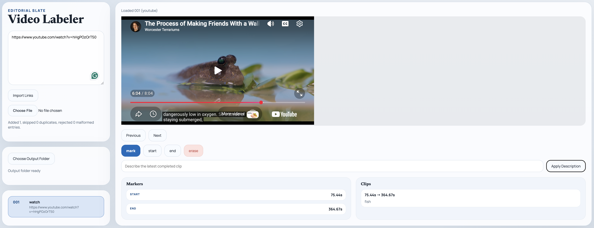

# Video Labeler

Video Labeler is a small browser tool for stepping through a queue of public video URLs and saving timestamped labeling output to a folder on your machine. It can import multiple links at once, play one video at a time, capture markers, build `start`/`end` clips, and write `index.csv`, `meta.json`, and `labels.json` as you work.



## Quick Start

From the `video-labeler/` folder:

```bash
npm test
npm run start
```

Then open `http://localhost:4173` in Chrome or Edge. The app uses the File System Access API, so a Chromium-based browser is required for folder selection and file writes.

## How To Use It

1. Click `Choose Output Folder` and pick the folder where you want exports saved.
2. Add videos in either of these ways:
   - Paste one or more URLs into the text box, then click `Import Links`.
   - Upload a `.txt` or `.csv` file containing URLs.
3. Select a video from the queue if it is not already active.
4. Play or scrub the video to the moment you want to label.
5. Use the labeling controls:
   - `mark` saves a single timestamped marker.
   - `start` records the start of a clip.
   - `end` closes the most recent open `start` and creates a clip.
   - `erase` removes the newest marker and any dependent clip created from it.
6. If you created a clip, type text into `Describe the latest completed clip` and click `Apply Description`.
7. Use `Previous` and `Next` to move through the imported queue.

The `Markers` and `Clips` panels update as you work, and files are written back to the selected output folder after each change.

## Supported Video Sources

- YouTube watch links
- `youtu.be` short links
- YouTube Shorts links
- Direct `.mp4`, `.webm`, and `.ogg` video URLs

Malformed rows in imported text or CSV files are skipped and reported in the import status message.

## What Gets Saved

After you choose an output folder, the app writes:

- `index.csv` in the root output folder with the ordered list of imported videos
- One subfolder per video, such as `001/`, `002/`, and `003/`
- `meta.json` inside each video folder with source details and summary metadata
- `labels.json` inside each video folder with saved markers and clips

## Example Output Layout

```text
your-output-folder/
  index.csv
  001/
    meta.json
    labels.json
  002/
    meta.json
    labels.json
```

## Tips And Limitations

- Choose the output folder early if you want files written immediately while you label.
- New imports append to the existing queue and continue the numbering sequence.
- Unsupported URLs can still be imported, but timestamp capture is unavailable if the source cannot be played by the current adapters.
- `labels.json` stores markers and clips only. Free-form custom label buttons are not part of the current UI yet.
